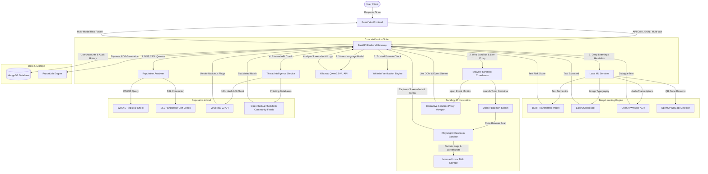

# SmartShield AI: Comprehensive Technical Project Report

**SmartShield AI** is an advanced, production-ready cybersecurity platform designed to protect users against digital scam threats across multiple communication channels—including text messages, image screenshots, voice call audio, email messages, target web URLs, and multi-modal combinations. 

By combining local deep-learning inference, generative AI vision-language pipelines (Ollama + Qwen2.5-VL), real-time threat intelligence feeds, automated containerized browser sandboxes, and an interactive live viewport auditor, the system delivers precise, explainable cybersecurity threat assessments.

---

## 1. System Architecture

The SmartShield AI platform is designed around a multi-layered verification and risk-fusion strategy. Below is a representation of the overall data flow and component interactions:



---

## 2. Core Diagnostic Modalities

SmartShield AI features a comprehensive suite of verification pipelines that cater to different digital formats:

### A. Text Scam Detector
* **Local NLP Model**: Utilizes a fine-tuned BERT Transformer (`mrm8488/bert-tiny-finetuned-sms-spam-detection`) running locally on CPU.
* **Regex & Keyword Heuristics**: Contains pre-defined scam keyword maps (OTP scans, banking traps, UPI prize frauds, work-from-home job traps, crypto seed requests) to calculate high-confidence keyword density scores.
* **Semantic Analysis**: Integrates local Qwen2.5-VL evaluation to semantically classify messages without solely relying on basic string matching.
* **Whitelist Checking**: Evaluates messages against known safe global domains to prevent false positives on legitimate transaction alerts or notification links.

### B. Secure URL Sandbox & Live Interactive Viewport
* **Containerized Playwright**: Backend connects to the host machine's Docker daemon via `/var/run/docker.sock`. It dynamically boots a transient container based on `smartshield-sandbox:latest`.
* **Behavior Monitoring**: A synchronous Playwright Python agent inside the container visits the target URL, monitors network requests, logs redirect chains, catches automatic download triggers, detects credential harvesting password input fields, and records console errors.
* **Visual Verification**: Captures a full-page PNG screenshot of the rendered webpage, saves the raw HTML snapshot, and self-destructs the container upon completion.
* **Host Fallback**: If the local Docker daemon is unreachable, the system automatically executes a local host-bound subprocess Playwright sandbox script.
* **Interactive Live Sandbox Viewport (`/api/scans/sandbox/proxy` & `/api/scans/sandbox/audit-session`)**: Renders target sites in an isolated iframe while injecting event monitoring scripts. Real-time DOM interactions (link clicks, password input focus, form submissions) are streamed to `/api/scans/sandbox/audit-session` to audit live user sessions and calculate risk.

### C. Screenshot OCR & QR Code Parser
* **Text Extraction**: Uses `EasyOCR` to read text overlaid on payment screenshots, bank block notifications, or lottery notices.
* **QR Resolver**: Employs `OpenCV`'s `QRCodeDetector` to locate and resolve links inside QR codes.
* **Sandboxed Scan Integration**: If the extracted text or QR code contains a URL, the backend automatically triggers the sandboxing pipeline to execute behavioral analysis on the target site.

### D. Voice Scam Whisper ASR
* **Speech-to-Text**: Decodes audio file uploads (MP3, WAV, M4A) of voice messages or phone calls using the `OpenAI Whisper` (`tiny`) model.
* **Context Analysis**: Feeds the transcription into the semantic risk engine to screen dialogue for voice phishing (vishing) signatures (e.g., customer support impersonation, OTP requests).

### E. Email Integrity Auditor
* **SPF Verification**: Queries the domain's TXT records using `dns.resolver` to check for valid sender SPF configurations.
* **DKIM Auditor**: Evaluates `DKIM-Signature` header presence in email headers.
* **Spoofing Verification**: Cross-references sender domains in envelope addresses against email headers to detect spoofing.
* **Body Scan**: Triggers text checks on the email body to isolate malicious links or payment calls to action.

### F. Unified Multimodal Scanner
* **Multi-Input Integration**: Allows users to submit text, target URL, screenshot image, and voice recording simultaneously in a single unified `/api/scans/unified` API call.
* **Cross-Modal Verification**: Aggregates extracted text, transcribed audio, resolved QR codes, and URL sandbox outputs before passing combined context to the Qwen2.5-VL vision-language model.

### G. Bulk Enterprise Batch Scanner
* **Batch Processing**: Enables organizational compliance auditing via `/api/scans/bulk` by scanning multiple SMS/email messages or URLs in a single batch request.
* **Audit Trail Persistence**: Automatically saves individual scan results to MongoDB for organizational record-keeping.

### H. Multi-Modal Risk Fusion Engine
Aggregates scores from all modules to arrive at a single unified risk score (0 to 100):
* **Text Scans**: Weighted blend of Qwen2.5-VL semantic classification (50%) and local ML/regex heuristics (50%). Incorporates URL sandbox scores if an embedded link is detected.
* **URL Scans**: 
  - **35%**: Playwright Browser Sandbox verdict (Automatic downloads, password input forms, console errors).
  - **25%**: Threat Intelligence score (VirusTotal detection counts, PhishTank, and OpenPhish list matches).
  - **20%**: SSL & WHOIS Reputation metrics (Domain age less than 30 days, missing WHOIS details, invalid certificate, typosquatting distance).
  - **20%**: Local Qwen2.5-VL Vision-Language checks on the page screenshot.
* **Email Scans**: Blends email technical header checks (40%) with body text/sandbox checks (60%).
* **Whitelist Override**: Any target domain matching verified global platforms (e.g., `google.com`, `microsoft.com`, `apple.com`, `github.com`, `youtube.com`) immediately receives a Safe override verdict (Score: 5.0).

---

## 3. Detailed Technology Stack

### Backend Stack
* **Runtime**: Python 3.10+
* **Framework**: FastAPI (high-performance async framework)
* **Web Server**: Uvicorn (ASGI server implementation)
* **Database Client**: Motor (async MongoDB driver for Python)
* **Security & Auth**: PyJWT / Cryptography (token creation/verification), Passlib with bcrypt (password hashing)
* **Machine Learning & Signal Processing**:
  - `transformers` & `torch`: BERT model loader
  - `easyocr` & `numpy`: Optical character recognition
  - `openai-whisper` & `soundfile`: Speech recognition
  - `opencv-python-headless`: Image processing & QR detection
* **Sandbox & Intel**:
  - `playwright`: Headless browser scripting
  - `docker`: Python SDK interacting with host Docker Engine
  - `python-whois`: Registrar lookup API
  - `dnspython`: SPF record resolver
  - `httpx`: Async HTTP client calling Ollama, VirusTotal, and proxying live sandbox web pages
* **Document Compilation**: `reportlab` (dynamic PDF construction)

### Frontend Stack
* **Framework**: React.js (V18) via Vite bundler
* **Routing**: React Router DOM (v6)
* **Styling**: TailwindCSS (v3.4.1) & custom style overrides in `frontend/src/index.css` (cyberpunk dark-theme aesthetics with glassmorphic cards)
* **Data Visualization**: Chart.js (`chart.js` & `react-chartjs-2`) for reporting audit analytics
* **Icons**: Heroicons (`@heroicons/react`)
* **API Client**: Axios (configured with intercepts for JWT token authentication)

---

## 4. Directory & File Organization

The workspace is organized into a modular monorepo structure:

```
major1/
├── docker-compose.yml              # System Docker orchestration template
├── README.md                       # High-level architecture documentation
├── project_report.md               # Complete technical project report (Markdown)
├── project_report.pdf              # Compiled technical project report (PDF)
├── backend/
│   ├── run.py                      # Local backend entrypoint
│   ├── Dockerfile                  # Backend build specification
│   ├── requirements.txt            # Python backend dependencies
│   ├── .env.example                # Config parameters template
│   └── app/
│       ├── main.py                 # FastAPI lifecycle, lifespans & route mounts
│       ├── api/
│       │   ├── auth.py             # Auth endpoints (Register, Login, Me)
│       │   ├── scans.py            # Primary scan endpoints (Text, URL, Image, Voice, Email, Unified, Bulk, Live Sandbox Proxy)
│       │   ├── admin.py            # System health metrics & administrative portals
│       │   └── deps.py             # Security dependency injection (get_current_user, get_current_admin)
│       ├── core/
│       │   ├── config.py           # Pydantic base configuration settings loader
│       │   ├── db.py               # MongoDB initialization & caches
│       │   └── security.py         # Bcrypt hashes and JWT token helpers
│       ├── models/
│       │   ├── user.py             # User schemas
│       │   ├── scan.py             # Scan request and response formats
│       │   └── admin.py            # Custom blacklist structures
│       └── services/
│           ├── ml_service.py       # Loaders & executors for BERT, EasyOCR & Whisper
│           ├── qwen_service.py     # Local Ollama Qwen2.5-VL interaction agent
│           ├── sandbox_service.py  # Container launcher & Playwright script caller
│           ├── fusion_engine.py    # Risk score aggregation and decision logics
│           ├── reputation_service.py # WHOIS, SSL, and typosquatting calculations
│           ├── threat_intel_service.py # VirusTotal, OpenPhish & PhishTank collectors
│           └── report_service.py   # ReportLab PDF building rules
├── frontend/
│   ├── Dockerfile                  # Nginx production multi-stage build template
│   ├── package.json                # React library configuration
│   ├── vite.config.js              # Vite server proxies & build configuration
│   ├── tailwind.config.js          # Theme customizations
│   └── src/
│       ├── main.jsx                # React engine bootstrapper
│       ├── App.jsx                 # Application shell routing and route guards
│       ├── index.css               # Dark theme variables, glassmorphic card utilities
│       ├── context/
│       │   └── AuthContext.jsx     # Global user authenticate state provider
│       ├── components/
│       │   ├── Navbar.jsx          # Upper global panel
│       │   ├── Sidebar.jsx         # Left navigation bar
│       │   ├── ProtectionBadge.jsx # Visual verdict chip (Safe, Suspicious, Dangerous)
│       │   ├── RiskMeter.jsx       # Half-doughnut risk visualization
│       │   └── StatsChart.jsx      # Historical analytics charts
│       └── pages/
│           ├── Scanner.jsx         # Multimodal scan forms & real-time scanner
│           ├── ScanHistory.jsx     # Searchable historic audit log
│           ├── AdminPanel.jsx      # Admin list user manager, blacklist editor & status logs
│           ├── Login.jsx           # User sign-in interface
│           └── Register.jsx        # User registration interface
├── sandbox/
│   ├── Dockerfile.sandbox          # Playwright image build script
│   └── sandbox_agent.py            # Playwright browser scan automation script
└── uploads/                        # Storage for screenshots, audio, and PDF reports
```

---

## 5. Database Schema Details

SmartShield AI uses MongoDB to store documents across four key collections:

### A. Users (`users` collection)
Stores authentication details and system roles.
```json
{
  "_id": "ObjectId",
  "email": "user@example.com",
  "hashed_password": "string (bcrypt)",
  "role": "string (user | admin)",
  "created_at": "ISODate"
}
```

### B. Scans (`scans` collection)
Stores historic diagnostic entries representing multi-modal scans.
```json
{
  "_id": "ObjectId",
  "user_id": "ObjectId (ref: users)",
  "type": "string (text | url | image | voice | email | unified)",
  "input_data": {
    "content": "string (optional)",
    "url": "string (optional)",
    "filename": "string (optional)",
    "file_path": "string (optional)",
    "transcript": "string (optional)",
    "extracted_text": "string (optional)",
    "spf_valid": "boolean (optional)",
    "dkim_valid": "boolean (optional)",
    "domain_mismatch": "boolean (optional)"
  },
  "qwen_result": {
    "score": "float",
    "confidence": "float",
    "category": "string",
    "explanation": "string",
    "highlighted_keywords": ["string"]
  },
  "url_metadata": {
    "url": "string",
    "domain": "string",
    "domain_age_days": "integer",
    "whois_info": "object",
    "ssl_valid": "boolean",
    "ssl_info": "object",
    "redirect_chain": ["string"],
    "is_shortener": "boolean",
    "suspicious_patterns": ["string"],
    "risk_score": "float"
  },
  "sandbox_report": {
    "executed": "boolean",
    "screenshot_url": "string (e.g. /api/scans/file/screenshots/...)",
    "html_snapshot_path": "string",
    "network_requests": [
      {
        "url": "string",
        "method": "string",
        "resource_type": "string",
        "domain": "string"
      }
    ],
    "download_attempts": [
      {
        "url": "string",
        "suggested_filename": "string"
      }
    ],
    "console_errors": ["string"],
    "detected_forms": [
      {
        "form_index": "integer",
        "action": "string",
        "has_password": "boolean",
        "input_types": [
          {
            "type": "string",
            "name": "string",
            "placeholder": "string"
          }
        ]
      }
    ],
    "behavior_findings": ["string"],
    "sandbox_verdict": "string (Safe | Suspicious | Dangerous)"
  },
  "threat_intel_score": "float",
  "threat_intel_details": "object",
  "fusion_result": {
    "final_score": "float",
    "category": "string (Safe | Suspicious | Dangerous)",
    "confidence": "float",
    "explanation": "string",
    "recommendations": ["string"]
  },
  "created_at": "ISODate"
}
```

### C. Blacklists (`blacklists` collection)
Contains domains or keywords blocked by administrators.
```json
{
  "_id": "ObjectId",
  "value": "suspicious-domain.com",
  "type": "string (domain | keyword)",
  "notes": "string",
  "created_at": "ISODate"
}
```

### D. Audit Logs (`audit_logs` collection)
Records admin actions (modifying roles, updating blacklist items) for compliance auditing.
```json
{
  "_id": "ObjectId",
  "user_id": "ObjectId",
  "user_email": "admin@example.com",
  "action": "string (Add Blacklist | Remove Blacklist | Update Role)",
  "details": "string",
  "created_at": "ISODate"
}
```

---

## 6. Installation & Deployment Guide

### Option 1: Execution via Docker Compose (Recommended)
1. Ensure **Docker Desktop** is active.
2. In the project root folder, execute:
   ```bash
   docker-compose up --build
   ```
3. Docker Compose builds and exposes:
   * **React Frontend**: [http://localhost:80](http://localhost:80)
   * **FastAPI Backend Swagger Docs**: [http://localhost:8000/docs](http://localhost:8000/docs)
   * **MongoDB Service**: Exposes port `27017`
   * **Sandbox Image**: Builds the `smartshield-sandbox:latest` container image.

### Option 2: Local Development Setup (Bare-Metal)
#### 1. Setup Backend
1. Navigate to the backend directory:
   ```bash
   cd backend
   ```
2. Create and activate a Python virtual environment:
   ```bash
   python -m venv venv
   # Windows:
   venv\Scripts\activate
   # macOS/Linux:
   source venv/bin/activate
   ```
3. Install package dependencies:
   ```bash
   pip install -r requirements.txt
   ```
4. Copy the environment template:
   ```bash
   copy .env.example .env
   ```
5. Install Local Playwright dependencies for host fallbacks:
   ```bash
   playwright install chromium
   ```
6. Launch the FastAPI Uvicorn engine:
   ```bash
   python run.py
   ```

#### 2. Setup Frontend
1. Navigate to the frontend directory:
   ```bash
   cd ../frontend
   ```
2. Install Node modules:
   ```bash
   npm install
   ```
3. Run the development Vite proxy server:
   ```bash
   npm run dev
   ```
4. Access the portal at [http://localhost:5173](http://localhost:5173).

---

## 7. Operational Walkthrough & Verification

1. **First User Auto-Elevation**: Upon registering an account for the first time on the portal, the backend automatically elevates the user to the **ADMIN** role.
2. **Text Semantics**: Submitting text like *"You won a lottery of 5 Lakhs, verify here: http://lottery-draw.in"* triggers the local model, which reads the link, runs a Playwright scan, and aggregates the findings with semantic AI feedback.
3. **Sandbox Scans**: Entering a target site in the URL Sandbox tab spins up the temporary Playwright container, records forms/network requests, captures screenshots, and displays the details on the dashboard.
4. **Interactive Live Viewport**: Users can interact with live web page previews inside an isolated proxy viewport while input events (such as entering passwords or submitting forms) are audited in real time.
5. **PDF Reports**: In the Scan History tab, clicking the "Download Report" button triggers ReportLab to output a multi-page PDF document complete with page layout tables, custom threat categories, and screenshot captures.
6. **System Administration**: Admin users can navigate to the Admin Panel page to view system statistics, monitor container execution counts, add/delete domains from the custom platform blacklist, and view security audit trails.
